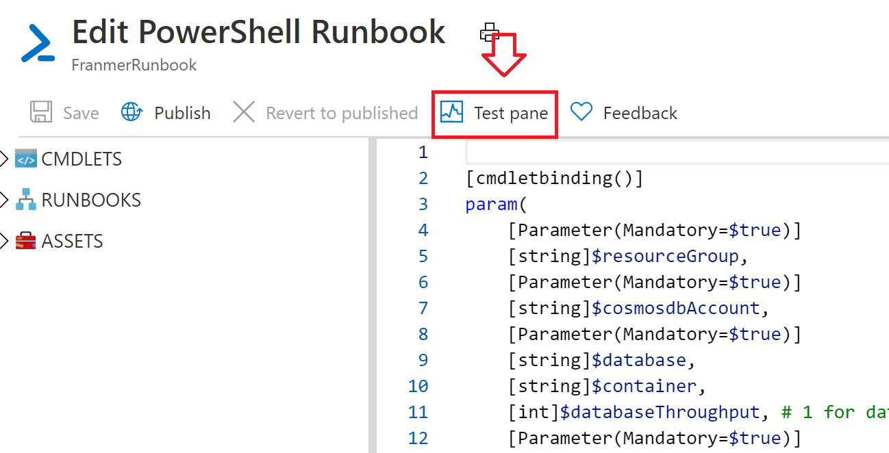

# Azure Cosmos DB : Pilotez les RU avec Azure Automation

Dans le scénario suivant, nous avons besoin d'ingérer et traiter une grande quantité d'information durant une période précise de la journée.
Etant donné que ce traitement se fait de manière récurrence et prédictible, il est donc aisé de planifier le changement de RU avec un service comme Azure automation.

Nous allons voir en détail comment mettre en place une solution avec Azure Automation pour effectuer ces changements de RU en fonction de nos besoins

## Prérequis

- [Un abonnement Azure](https://azure.microsoft.com/fr-fr/free/)


# Création des services Azure
## Création d'un groupe de ressources
Nous allons commencer par créer un groupe de ressources afin d'héberger les différents services de notre solution.

Depuis le portail [Azure](https://portal.azure.com), cliquez sur "**Create a resource**"


 Puis, recherchez "**Resource group**"

 


Cliquez sur le bouton "**Create**"


Donnez un nom au groupe de ressources puis cliquez sur le bouton "**Review + create**"


Puis validez la création en cliquant sur le bouton "**Create**"


## Creation du compte Azure Cosmos DB

Depuis le portail [Azure](https://portal.azure.com), cliquez sur "**Create a resource**"


Recherchez le service Azure Cosmos DB


Puis cliquez sur le bouton "**Create**"


Sélectionnez le groupe de ressources créé précédemment, définissez les options dont vous avez besoin puis cliquez sur le bouton "**Review + create**"


Cliquez sur le bouton "**Create**"


Une fois le compte Azure Cosmos DB créé, cliquez sur le bouton "**Go to resource**" afin de créer une base et un conteneur.


Cliquez sur "**Overview**" puis sur "**Add Container**"


Créez une nouvelle base de données ainsi qu'un nouveau conteneur. Dans cet exemple nous allons décocher la case "**Provision database throughput**" (mais le script fonctionnera aussi avec cette case cochée).

Cliquez sur le bouton "**Ok**"


Une fois la base et le conteneur créés, ils devront être visibles depuis la vue d'ensemble de votre compte Azure Cosmos DB 


## Création du Service Azure Automation

Depuis le portail [Azure](https://portal.azure.com), cliquez sur "**Create a resource**"


Puis recherchez "**Automation**"


Cliquez sur le bouton "**Create**


Donnez un nom à votre compte "*Automation*", choisissez le groupe de ressources créé précédemment et sélectionnez "**Yes**" pour "**Create Azure Run As account**"

Cliquez sur le bouton "**Create**"


Après la création du compte "*Azure Automation*", vous devriez donc avoir les ressources suivantes dans votre groupe de ressources


## Paramétrage du compte Azure Automation

Cliquez sur votre compte **Azure Automation**


Cliquez sur "**Runbooks**" puis sur "**Create a runbook**"


Donnez un nom à votre *runbook*.
Choisissez "**PowerShell**" dans la liste déroulante "**Runbook type**"

Cliquez sur le bouton "**Create**"


Copiez le script PowerShell ci-dessous. Ce script est aussi disponible sur le [repo GitHub de Hugo Girard](https://github.com/hugogirard/azureScripts/tree/master/runbook/scaleUnitCosmosDB), qui a grandement contribué à l'écriture du script. Merci Hugo :) ! 

```javascript

[cmdletbinding()]
param(
    [Parameter(Mandatory=$true)]
    [string]$resourceGroup,    
    [Parameter(Mandatory=$true)]
    [string]$cosmosdbAccount,
    [Parameter(Mandatory=$true)]
    [string]$database,    
    [string]$container,    
    [int]$databaseThroughput, # 1 for database throughput otherwise no need this parameters    
    [Parameter(Mandatory=$true)]
    [int]$newRUs
)
$connectionName = "AzureRunAsConnection"
try {
    $servicePrincipalConnection=Get-AutomationConnection -Name $connectionName
    "Logging in Azure..."
    Connect-AzAccount -ServicePrincipal `
        -TenantId $servicePrincipalConnection.TenantId `
        -ApplicationId $servicePrincipalConnection.ApplicationId `
        -CertificateThumbprint $servicePrincipalConnection.CertificateThumbprint
    if ($databaseThroughput -eq 1) {
        Write-Output "Update request units database level"
        $throughput = Get-AzCosmosDBSqlDatabaseThroughput -ResourceGroupName $resourceGroup `
                      -AccountName $cosmosdbAccount -Name $database
    } else {
        Write-Output "Update request units container level"
        $throughput = Get-AzCosmosDBSqlContainerThroughput -ResourceGroupName $resourceGroup `
        -AccountName $cosmosdbAccount -DatabaseName $database -Name $container
    }
    
    $currentRUs = $throughput.Throughput
    $minimumRUs = $throughput.MinimumThroughput
    
    Write-Output "Current throughput is $currentRUs. Minimum allowed throughput is $minimumRUs."
    
    if ([int]$newRUs -lt [int]$minimumRUs) {
        Write-Output "Requested new throughput of $newRUs is less than minimum allowed throughput of $minimumRUs."
        Write-Output "Using minimum allowed throughput of $minimumRUs instead."
        $newRUs = $minimumRUs
    }
    
    if ([int]$newRUs -eq [int]$currentRUs) {
        Write-Output "New throughput is the same as current throughput. No change needed."
    }
    else {
        Write-Output "Updating throughput to $newRUs."
        
        if ($databaseThroughput -eq 1) {
            Update-AzCosmosDBSqlDatabaseThroughput -ResourceGroupName $resourceGroup `
            -AccountName $cosmosdbAccount -Name $database `
            -Throughput $newRUs
        } else {
            Update-AzCosmosDBSqlContainerThroughput -ResourceGroupName $resourceGroup `
            -AccountName $cosmosdbAccount -DatabaseName $database `
            -Name $container -Throughput $newRUs
        }
    }
}
catch {
    if (!$servicePrincipalConnection)
    {
        $ErrorMessage = "Connection $connectionName not found."
        throw $ErrorMessage
    } else{
        Write-Error -Message $_.Exception
        throw $_.Exception
    }    
}
 ```


Puis cliquez sur le bouton "**Save**"


A ce stade-ci de l'article, le script ne fonctionnera pas encore. Il est nécessaire de rajouter deux modules pour le faire fonctionner.

Cliquez sur la croix en haut à droite pour fermer la fenêtre d'édition


Puis faîte de même pour fermer le runbook


Sur la gauche, cliquez sur "**Module**", puis sur "**Browse gallery**"


Rajoutez les 2 modules suivants :

- Az.Accounts
- Az.CosmosDB

Ci-dessous une illustration pour le module Az.Accounts

Recherchez le module Az.Accounts


Puis cliquez sur "**Import**" puis dans la fenêtre suivante sur "**Ok**"


Recommencez l'opération pour le module Az.CosmosDB

Vérifiez que les modules soient bien présents et que l'importation est bien terminée


Revenez dans votre runbook


Cliquez sur le bouton "**Edit**"


Cliquez sur "**Test pane**"



1. Remplissez les champs sur la gauche avec les informations demandées concernant Azure Cosmos DB (ici nous pilotons les RU au niveau du conteneur, donc j'ai laissé le champ *databasethroughput* vide, sinon, pour agir au niveau de la base de données, il suffit d'entrer la valeur : 1). J'ai défini le nouveau niveau de RU à 500 (au lieu de 400).

2. Cliquez sur "**Start**"


Si tout se passe correctement, vous devez obtenir le message suivant


Mais surtout, votre conteneur à maintenant 500 RU


## Programmer une exécution récurrente

Maintenant que le plus dur est fait, il ne nous reste plus qu'à planifier l'exécution de notre script

Depuis la fenêtre d'édition du runbook, cliquez sur "**Publish**" puis sur "**Yes**"


Dans votre runbook, cliquez sur "**Schedules**"


Cliquez sur "**Add a schedule**"


Cliquez sur "**Schedule**" 


Puis "**Create a new schedule**"


Entrez les paramètres de votre planification puis cliquez sur "**Create**"


Ensuite cliquez sur "**Configure parameters and run settings**"


Entrez les informations concernant votre conteneur Azure Cosmos DB puis cliquez sur "**Ok**


Validez la création de votre planification en cliquant sur "**Ok**"


Vous avez donc une planification programmée.


Il est possible de créer plusieurs autres planifications, pour par exemple revoir les RU à la baisse si besoin


## Monitoring

Cliquez sur "**Jobs**" si vous souhaitez avoir un statut de vos planifications

