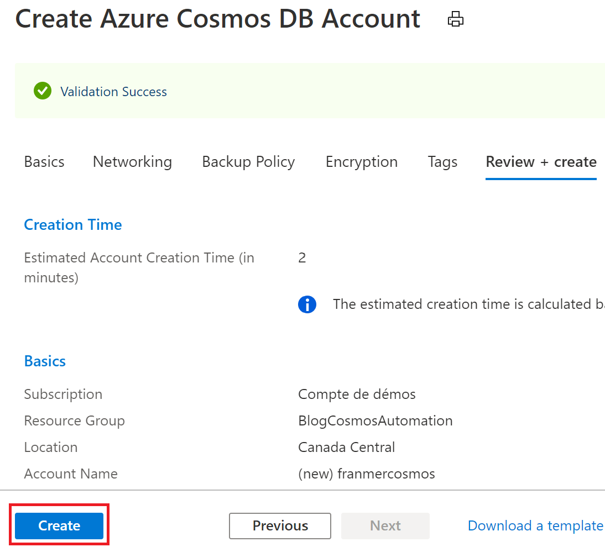

# Azure Cosmos DB: Manage RU with Azure Automation

In the following scenario, we need to ingest and process a large amount of information during a specific period of the day.
Since this treatment is done in a recurrence and predictable way, it is easy to plan the change of RU with a service like Azure automation.

We'll see in detail how to implement a solution with Azure Automation to make these RU changes based on our needs

## Prerequisite

- [Azure Free trial](https://azure.microsoft.com/en-us/free/)


# Creating Azure services
## Creating a resource group
We will start by creating a group of resources to host the different services of our solution.

From [Azure portal](https://portal.azure.com), click "**Create a resource**"


Then "**Resource group**"

 


Click "**Create**"


Name the resource group and click the button  "**Review + create**"


Then validate the creation by clicking the button "**Create**"


## Azure Cosmos DB account creation

From [Azure portal](https://portal.azure.com), click "**Create a resource**"


Search for Azure Cosmos DB


Then click "**Create**"


Select the previously created resource group, set the options you need, then click the button "**Review + create**"


Click "**Create**"



Once the Azure Cosmos DB account is created, click "**Go to resource**" to create database and container


Click "**Overview**" then "**Add Container**"


Create a new database and a new container. In this example we're going to uncheck the box "**Provision database throughput**" (but the script will also work with this checked box).

Click "**Ok**"


Once the base and container are created, they will be visible from your Azure Cosmos DB account overview 


## Azure Automation service creation

From [Azure portal ](https://portal.azure.com), click "**Create a resource**"


Then search for "**Automation**"


Click "**Create**


Name your Automation account, choose the resource group created previously and select "**Yes**" for "**Create Azure Run As account**"

Click "**Create**"


After creating the Azure Automation account, you should have the following resources in your resource group


## Azure Automation account setting up

Click on your **Azure Automation** account


Click on "**Runbooks**" then on "**Create a runbook**"


Name your runbook.

Select "**PowerShell**" in "**Runbook type**" drop-down list

Click "**Create**"


Copy the PowerShell script below. This script is also available on [Hugo Girard's Github repo](https://github.com/hugogirard/azureScripts/tree/master/runbook/scaleUnitCosmosDB), who helped a lot by writting the script. Thank you Hugo :)! 

```javascript

[cmdletbinding()]
param(
    [Parameter(Mandatory=$true)]
    [string]$resourceGroup,    
    [Parameter(Mandatory=$true)]
    [string]$cosmosdbAccount,
    [Parameter(Mandatory=$true)]
    [string]$database,    
    [string]$container,    
    [int]$databaseThroughput, # 1 for database throughput otherwise no need this parameters    
    [Parameter(Mandatory=$true)]
    [int]$newRUs
)
$connectionName = "AzureRunAsConnection"
try {
    $servicePrincipalConnection=Get-AutomationConnection -Name $connectionName
    "Logging in Azure..."
    Connect-AzAccount -ServicePrincipal `
        -TenantId $servicePrincipalConnection.TenantId `
        -ApplicationId $servicePrincipalConnection.ApplicationId `
        -CertificateThumbprint $servicePrincipalConnection.CertificateThumbprint
    if ($databaseThroughput -eq 1) {
        Write-Output "Update request units database level"
        $throughput = Get-AzCosmosDBSqlDatabaseThroughput -ResourceGroupName $resourceGroup `
                      -AccountName $cosmosdbAccount -Name $database
    } else {
        Write-Output "Update request units container level"
        $throughput = Get-AzCosmosDBSqlContainerThroughput -ResourceGroupName $resourceGroup `
        -AccountName $cosmosdbAccount -DatabaseName $database -Name $container
    }
    
    $currentRUs = $throughput.Throughput
    $minimumRUs = $throughput.MinimumThroughput
    
    Write-Output "Current throughput is $currentRUs. Minimum allowed throughput is $minimumRUs."
    
    if ([int]$newRUs -lt [int]$minimumRUs) {
        Write-Output "Requested new throughput of $newRUs is less than minimum allowed throughput of $minimumRUs."
        Write-Output "Using minimum allowed throughput of $minimumRUs instead."
        $newRUs = $minimumRUs
    }
    
    if ([int]$newRUs -eq [int]$currentRUs) {
        Write-Output "New throughput is the same as current throughput. No change needed."
    }
    else {
        Write-Output "Updating throughput to $newRUs."
        
        if ($databaseThroughput -eq 1) {
            Update-AzCosmosDBSqlDatabaseThroughput -ResourceGroupName $resourceGroup `
            -AccountName $cosmosdbAccount -Name $database `
            -Throughput $newRUs
        } else {
            Update-AzCosmosDBSqlContainerThroughput -ResourceGroupName $resourceGroup `
            -AccountName $cosmosdbAccount -DatabaseName $database `
            -Name $container -Throughput $newRUs
        }
    }
}
catch {
    if (!$servicePrincipalConnection)
    {
        $ErrorMessage = "Connection $connectionName not found."
        throw $ErrorMessage
    } else{
        Write-Error -Message $_.Exception
        throw $_.Exception
    }    
}
 ```


Click "**Save**"


At this point in the article, the script will not work yet. It is necessary to add two modules to make it work.

Click on the cross at the top right to close the editing window


Then do the same to close the runbook


On the left, click  "**Module**", then on "**Browse gallery**"


Add the following two modules: 

- Az.Accounts
- Az.CosmosDB

Below is an illustration for the Az.Accounts module

Search Az.Accounts module


Then click "**Import**" then in the next window on "**Ok**"


Repeat the operation for the Az.CosmosDB module

Make sure the modules are present and that the import is complete


Get back in your runbook


Click "**Edit**"


Click "**Test pane**"


1. Fill the fields on the left with the requested information regarding Azure Cosmos DB (here we set the RUs at the container level, so I left the field 'databasethroughput' empty, otherwise, to act at the database level, just enter the value: 1). I set the new RU level to 500 (instead of 400)..

2. Click "**Start**"


If everything goes right, you need to get the following message


But most importantly, your container now runs at 500 RU


## Schedule a recurring execution

Now that the hardest part is done, all we have to do is plan the execution of our script

From the runbook's editing window, click "**Publish**" and then "**Yes**"


In your runbook, click "**Schedules**"


Click "**Add a schedule**"


Click "**Schedule**" 


Puis "**Create a new schedule**"


Enter your planning parameters and then Click "**Create**"


 Click "**Configure parameters and run settings**"


Enter information about your Azure Cosmos DB container and then Click "**Ok**


Validate your schedule by clicking on "**Ok**"


Your schedule is now ready.


It is possible to create several other schedules, for example to decrease RU if necessary


## Monitoring

Click "**Jobs**" if you want to have a status of your schedules

